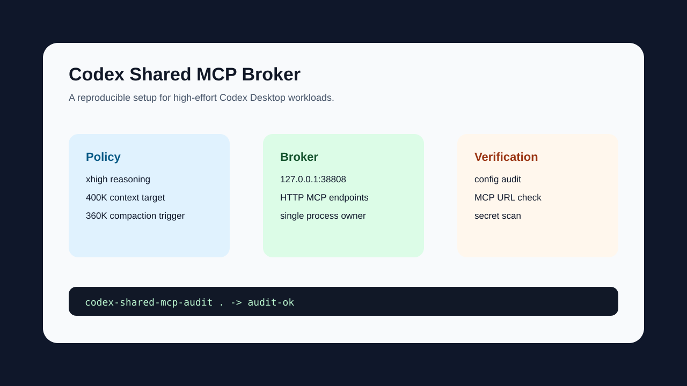
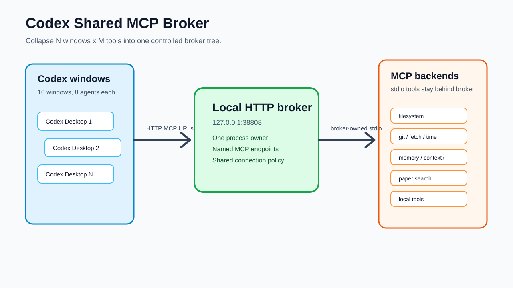
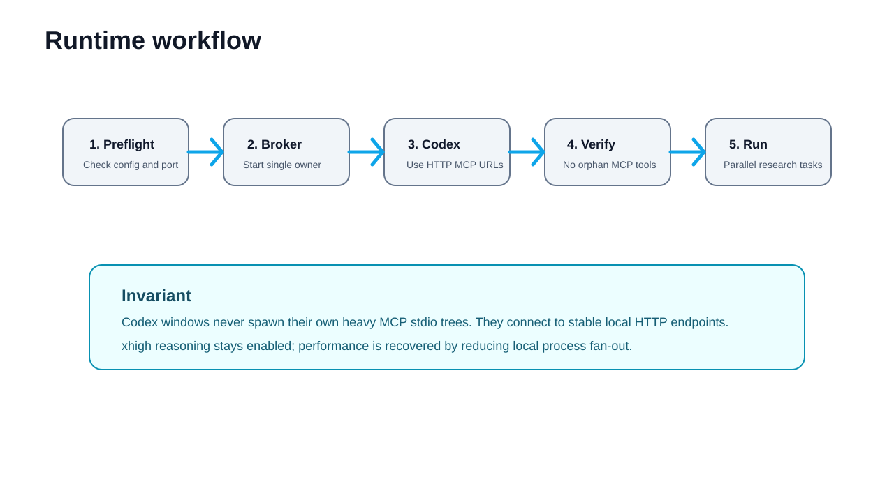
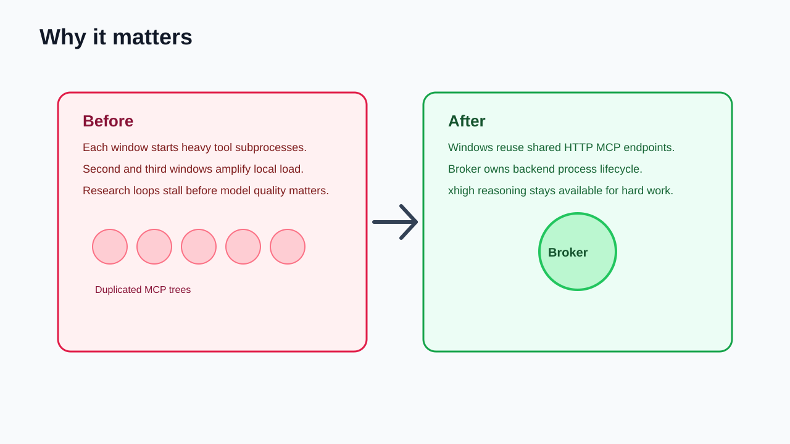

# Codex Shared MCP Broker



Codex Shared MCP Broker is a reproducible Windows setup for running multiple Codex Desktop windows with shared MCP tooling. It documents the configuration pattern, example broker registry, validation checks, diagrams, and release hygiene needed to avoid local MCP process fan-out.

## Problem

In a multi-window Codex Desktop workflow, a single window can be fast, while the second, third, or fourth window becomes slow. A common local cause is not the model itself. It is local tool fan-out:

- each window starts its own MCP stdio subprocesses;
- Node, Python, `npx`, `uvx`, Git, fetch, filesystem, memory, and similar tools accumulate;
- local CPU and memory pressure grow faster than the number of visible windows;
- long scientific/research tasks stall before the model can do useful work.

## Design

The core pattern is:

1. Keep Codex reasoning quality high: `model_reasoning_effort = "xhigh"`.
2. Keep the desired policy target: `model_context_window = 400000`.
3. Put MCP backends behind one local HTTP broker.
4. Point Codex MCP entries at URLs such as `http://127.0.0.1:38808/servers/git/mcp`.
5. Verify that Codex no longer lists direct `npx`, `uvx`, `python`, or `powershell` MCP commands.



## What This Repository Contains

- bilingual README files;
- bilingual architecture notes;
- GitHub landscape and differentiation notes;
- sanitized Codex config examples;
- sanitized MCP backend registry example;
- PowerShell preflight checks;
- Python repository audit CLI;
- CI workflow for tests and public artifact audit;
- SVG diagrams for architecture, workflow, impact, and product overview;
- Image2 prompts for generating polished bitmap assets.

## What This Repository Does Not Include

This is intentionally not a dump of a private machine configuration.

It does not include:

- API keys;
- OAuth tokens;
- billing or quota settings;
- private routing configuration;
- local account state;
- production queues;
- private absolute paths except harmless example placeholders.

## Example Codex Policy

```toml
model = "gpt-5.5"
model_reasoning_effort = "xhigh"
model_context_window = 400000
model_auto_compact_token_limit = 360000
service_tier = "fast"

[agents]
max_threads = 96
max_depth = 8

[mcp_servers.git]
url = "http://127.0.0.1:38808/servers/git/mcp"
```

Full example: [examples/codex-config.toml](examples/codex-config.toml).

## Validation

Install and run the checks:

```powershell
python -m pip install -e ".[test]"
python -m pytest
codex-shared-mcp-audit .
```

On a configured machine, run:

```powershell
powershell -ExecutionPolicy Bypass -File scripts/preflight.ps1
```

Expected public repository result:

```text
audit-ok
```

## Runtime Workflow



## Impact



The intended outcome is not "infinite concurrency". Hardware, model service limits, and runtime scheduling still matter. The intended outcome is to remove a preventable local bottleneck: duplicated MCP process trees per Codex window.

## Context Window Note

A local config can document and request a `400000` context policy, but Codex Desktop may report a smaller live `model_context_window` when `xhigh` reasoning is active. In observed runs, `xhigh` can reserve a large reasoning budget and expose a smaller effective live window. This repository keeps `xhigh` because the target workload is complex research, and it optimizes the local MCP/process layer instead of reducing reasoning effort.

## Related Projects

This project is not the first MCP proxy or gateway. See [docs/github-landscape.en.md](docs/github-landscape.en.md).

The differentiating scope here is narrower:

> Windows + Codex Desktop + multi-window MCP process fan-out + shared local HTTP broker + reproducible validation.

## License

MIT.

