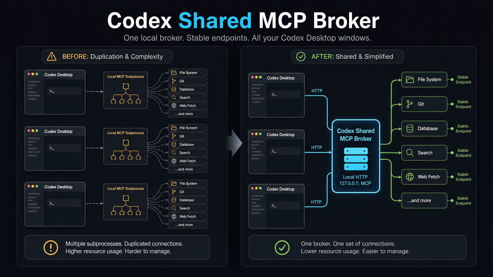
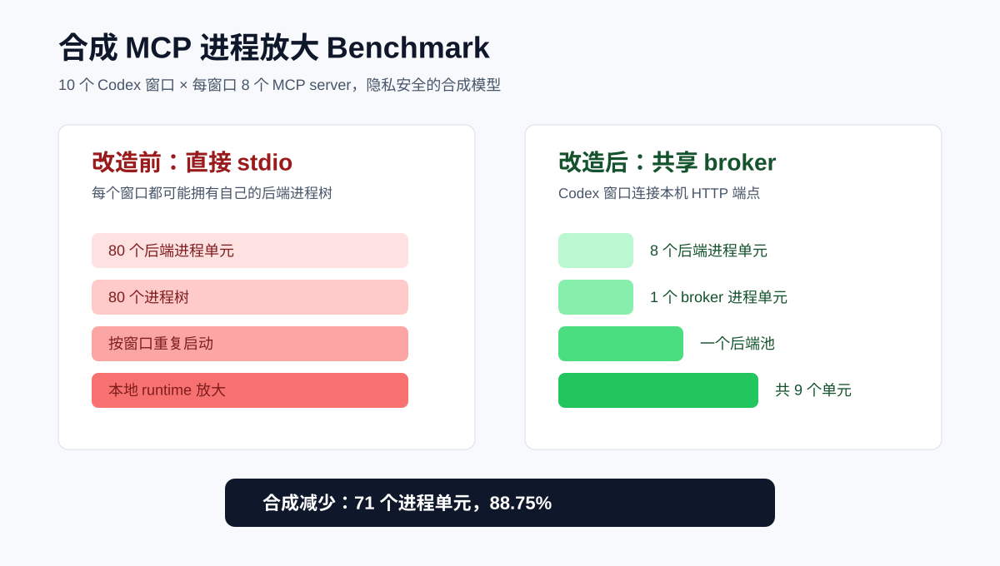
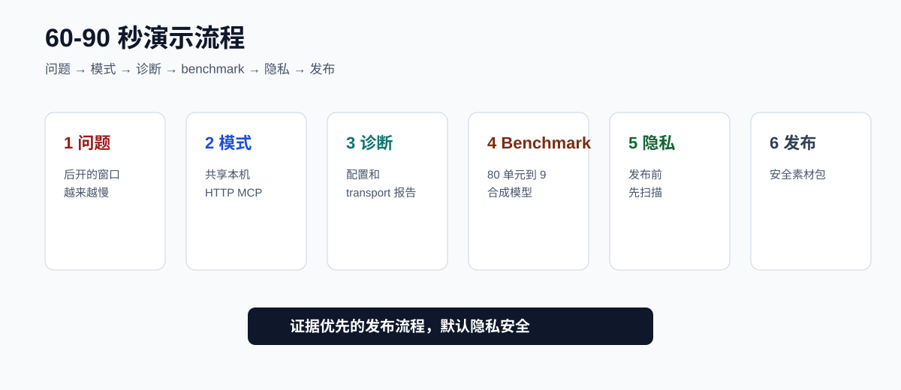
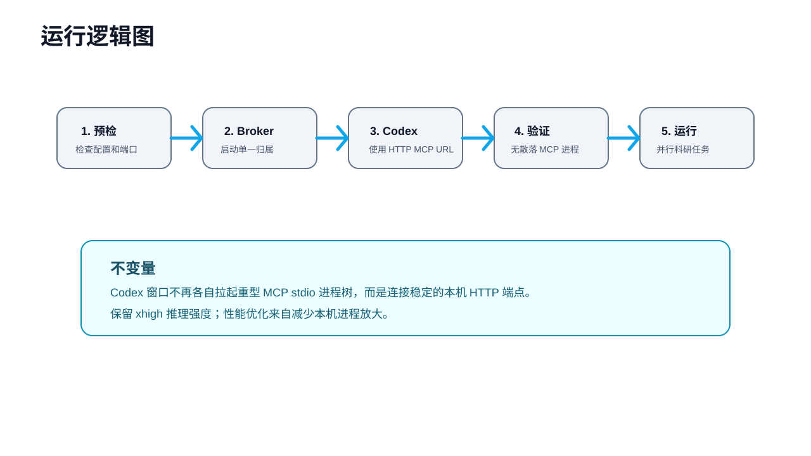
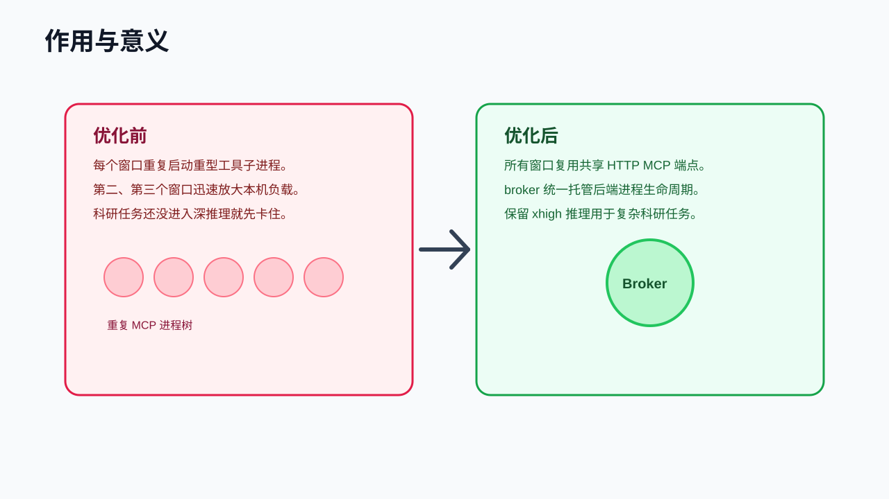

# Codex 共享 MCP Broker

[](https://github.com/sddvacav/codex-shared-mcp-broker/actions/workflows/ci.yml)
[](https://github.com/sddvacav/codex-shared-mcp-broker/releases)
[](LICENSE)


Codex Shared MCP Broker 是一个面向 Windows 和 Codex Desktop 的开源项目，用来复现、说明和验证“多窗口共享 MCP broker”的配置方式。

**一句话定位：** 在本机 MCP 进程放大拖垮 AI 编程工作站之前，把它收束到一个共享 broker。

它解决的核心问题是：第一个 Codex 窗口运行很快，但第二、第三、第四个窗口开启后，因为每个窗口都重复拉起一套 MCP stdio 工具进程，导致本机负载迅速放大，最终出现明显卡顿。

## 为什么值得 Star

- 你同时开多个 Codex Desktop 窗口，后开的窗口越来越慢。
- 你使用 MCP server，并怀疑本机 `npx` / `uvx` / Python 子进程重复启动。
- 你希望保留 `xhigh` 推理强度，而不是为了速度降低模型质量。
- 你需要一个脱敏、可复现的共享 HTTP MCP 配置模式。
- 你关心 agent runtime 隐私和公开发布安全。

## 问题

在多窗口 Codex Desktop 工作流里，卡顿不一定来自模型本身。一个常见的本地原因是工具进程爆炸：

- 每个窗口都启动自己的 MCP stdio 子进程；
- Node、Python、`npx`、`uvx`、Git、fetch、filesystem、memory 等进程不断叠加；
- 本机 CPU 和内存压力增长速度高于窗口数量；
- 长时间复杂科研任务还没进入有效推理，就先被本地工具层拖住。

## 设计原则

这个项目的原则是：

1. 保留高质量推理：`model_reasoning_effort = "xhigh"`。
2. 保留上下文策略目标：`model_context_window = 400000`。
3. 把 MCP 后端放到一个本机 HTTP broker 后面。
4. Codex MCP 配置指向类似 `http://127.0.0.1:38808/servers/git/mcp` 的 URL。
5. 验证 Codex 不再直接列出 `npx`、`uvx`、`python`、`powershell` 这类 MCP 启动命令。


## 仓库内容

- 中英文 README；
- 中英文架构说明；
- GitHub 相关项目对比和差异化定位；
- 脱敏后的 Codex 配置示例；
- 脱敏后的 MCP 后端注册表示例；
- PowerShell 预检脚本；
- Python 仓库审计 CLI；
- 隐私安全 runtime 诊断和合成 benchmark 命令；
- GitHub Actions CI；
- 架构图、运行逻辑图、作用图、产品图；
- Image2 位图生成提示词和成品图；
- GitHub 热度路线图和发布帖草稿。

## Image2 设计资产



成品位图已提交在 [assets/image2](assets/image2)。源提示词已提交在 [assets/image2-prompts](assets/image2-prompts)。完整设计流程见：[docs/design-process.zh.md](docs/design-process.zh.md)。

## 不包含什么

这个仓库不是私有机器配置的直接拷贝。

它不会包含：

- API key；
- OAuth token；
- 计费或额度设置；
- 私有路由配置；
- 本地账号状态；
- 生产队列；
- 除示例占位符以外的私有绝对路径。

## 示例配置

```toml
model = "gpt-5.5"
model_reasoning_effort = "xhigh"
model_context_window = 400000
model_auto_compact_token_limit = 360000
service_tier = "fast"

[agents]
max_threads = 96
max_depth = 8

[mcp_servers.git]
url = "http://127.0.0.1:38808/servers/git/mcp"
```

完整示例见：[examples/codex-config.toml](examples/codex-config.toml)。

## 验证

本仓库测试：

```powershell
python -m pip install -e ".[test]"
python -m pytest
codex-shared-mcp-audit .
```

生成隐私安全的 runtime 诊断报告：

```powershell
codex-shared-mcp-diagnose --output codex-runtime-report.md
```

诊断报告会汇总：

- `xhigh`、`400000`、`360000` 等 Codex 策略值；
- MCP 条目是否使用共享本机 HTTP URL；
- 实时 `codex mcp list` 输出里是否仍有 stdio 风格工具命令；
- broker 端口是否可达；
- 红/黄/绿状态和下一步建议。

它不会输出私有绝对路径、账号 ID、token 或本地路由细节。

生成合成 fan-out benchmark：

```powershell
codex-shared-mcp-benchmark --windows 10 --servers 8 --output benchmark.md
```

默认结果：直接 stdio 是 80 个合成进程单元，共享 broker 是 9 个，合成减少 88.75%。



演示分镜：



运行 agent runtime privacy guard：

```powershell
agent-runtime-privacy-guard .
```

它会检查公开发布产物中的常见密钥形态和本地 agent runtime 隐私细节，但不会打印匹配到的密钥值。

渲染 Remotion 演示视频：

```powershell
npm install
npm run video:render
```

演示视频：[assets/remotion/codex-shared-mcp-demo.mp4](assets/remotion/codex-shared-mcp-demo.mp4)

静态发布页源码：[site/index.html](site/index.html)。

已配置机器上的预检：

```powershell
powershell -ExecutionPolicy Bypass -File scripts/preflight.ps1
```

期望仓库审计结果：

```text
audit-ok
```

## 运行逻辑



## 作用



这个项目不承诺“无限并发”。硬件、模型服务限额、客户端运行时调度仍然存在上限。它解决的是一个明确且可避免的本地瓶颈：每个 Codex 窗口重复拉起 MCP 工具进程树。

## 400K 与 258K 说明

本地配置可以设置并记录 `400000` 的上下文策略目标，但 Codex Desktop 在 `xhigh` 推理强度下，运行时可能显示更小的 live `model_context_window`。观察到的情况是：`xhigh` 会为推理预算预留较大空间，因此当前窗口可能显示约 `258400`。本项目不通过降低推理强度来换速度，因为目标工作负载是复杂科研任务；优化点放在 MCP 与本机进程层。

## 相关项目

这个项目不是第一个 MCP proxy 或 gateway。见：[docs/github-landscape.zh.md](docs/github-landscape.zh.md)。

它的差异化定位更具体：

> Windows + Codex Desktop + 多窗口 MCP 进程爆炸 + 本机共享 HTTP broker + 可复现验证。

## GitHub 增长路线

公开路线图见：[docs/github-heat-roadmap.zh.md](docs/github-heat-roadmap.zh.md)。简短版本：

1. 把这个仓库做成 Codex Desktop + MCP 进程放大的旗舰案例。
2. 抽出可复用的 runtime privacy 检查工具。
3. 增加其他 MCP-heavy agent 桌面客户端的示例。
4. 使用 [docs/launch-post.zh.md](docs/launch-post.zh.md) 作为发布帖底稿。

补充发布资产：

- [ROADMAP.md](ROADMAP.md)
- [PUBLIC_STAGE.md](PUBLIC_STAGE.md)
- [docs/agent-runtime-privacy-guard.zh.md](docs/agent-runtime-privacy-guard.zh.md)
- [docs/benchmark.zh.md](docs/benchmark.zh.md)
- [docs/cross-client-runtime-notes.zh.md](docs/cross-client-runtime-notes.zh.md)
- [docs/demo-script.zh.md](docs/demo-script.zh.md)
- [docs/release-asset-pack.zh.md](docs/release-asset-pack.zh.md)
- [docs/design-flow-v0.06.zh.md](docs/design-flow-v0.06.zh.md)
- [docs/remotion-demo.zh.md](docs/remotion-demo.zh.md)
- [docs/deployment-commercial-chain.zh.md](docs/deployment-commercial-chain.zh.md)
- [docs/material-library.zh.md](docs/material-library.zh.md)
- [docs/hosted-product-blueprint.zh.md](docs/hosted-product-blueprint.zh.md)
- [docs/current-source-check.zh.md](docs/current-source-check.zh.md)
- [docs/demo-benchmark-plan.zh.md](docs/demo-benchmark-plan.zh.md)

## 许可证

MIT。
