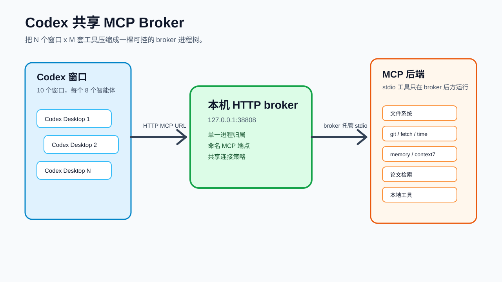

# 架构说明



## 目标

目标是在多窗口、高推理强度的 Codex Desktop 工作负载下，减少本机 MCP 工具进程重复启动导致的卡顿。

目标任务是复杂科研任务，所以本方案保留：

- `model_reasoning_effort = "xhigh"`；
- `400000` 的上下文策略目标；
- 通过本机 HTTP broker 共享 MCP 工具。

## 组件

### Codex Desktop 窗口

可以同时运行多个 Codex Desktop 窗口。但这些窗口不应各自拥有一整套重型 MCP stdio 后端进程树。

### 共享 HTTP MCP Broker

broker 在本机监听，常用地址：

```text
127.0.0.1:38808
```

它暴露命名端点：

```text
http://127.0.0.1:38808/servers/git/mcp
http://127.0.0.1:38808/servers/filesystem/mcp
http://127.0.0.1:38808/servers/fetch/mcp
```

### MCP 后端

后端仍然可以是 stdio 工具。关键变化是进程归属：后端生命周期由 broker 统一管理，而不是由每个 Codex 窗口重复管理。

## 验证不变量

配置正确时，应满足：

- `codex mcp list` 对本地 MCP server 显示 HTTP URL；
- Codex 活跃 MCP 列表里不再直接出现 `npx`、`uvx`、`python`、`powershell` 启动项；
- broker 端口在本机监听；
- 进程检查显示 broker 外没有 MCP 后端残留；
- 公开配置示例不包含 token 或私有凭证。

## 400K 与 xhigh

本地配置可以请求：

```toml
model_context_window = 400000
model_auto_compact_token_limit = 360000
model_reasoning_effort = "xhigh"
```

Codex Desktop 在 `xhigh` 下仍可能显示更小的运行时上下文窗口，因为运行时可能为推理预算预留空间。本仓库把这视为客户端运行时行为，优化重点放在 MCP 和本机进程层，而不是降低推理质量。

