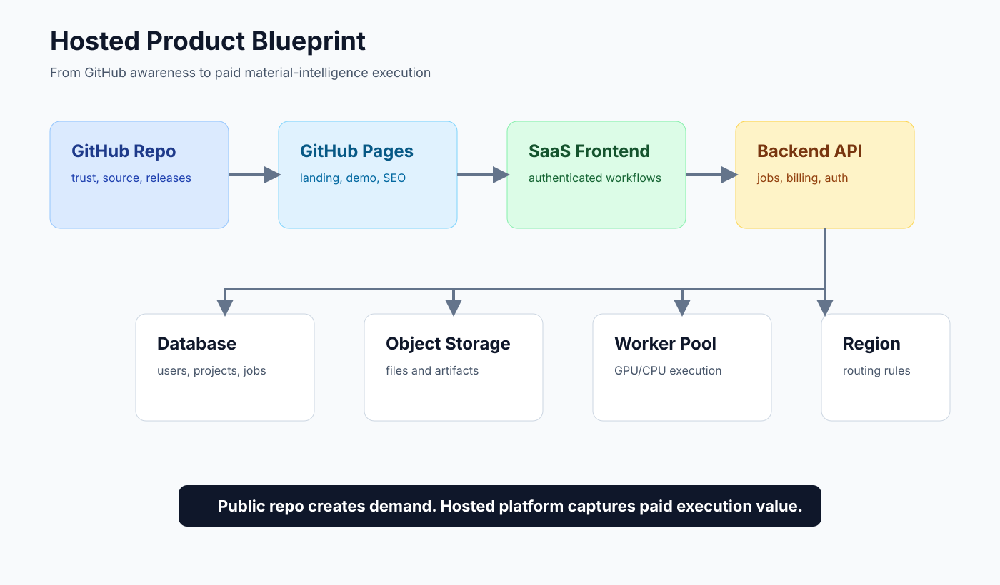

# Hosted Product Blueprint

Public stage: `0.09`

This blueprint describes how the public Codex/MCP launch surface connects to a future hosted material-intelligence design platform.

It intentionally avoids private infrastructure details. Do not put real domains, database URLs, API keys, account IDs, routing rules, production queues, or local paths in this document.

## Product Layers

| Layer | Purpose | Public repo content | Private/product content |
| --- | --- | --- | --- |
| GitHub repository | Trust, source, reproducibility | Open-source code, docs, releases, issues | No secrets |
| GitHub Pages | Static awareness and SEO | Landing page, Remotion demo, benchmark image | No backend |
| SaaS frontend | User workflows | Public screenshots or sanitized UI plans | Authenticated app |
| Backend API | Product logic | API shape docs only | Accounts, permissions, billing, jobs |
| Database | Durable state | Schema sketches only | Users, projects, jobs, audit logs |
| Object storage | Large artifacts | Storage pattern docs | PDFs, datasets, videos, generated files |
| Worker pool | Heavy execution | Worker architecture docs | GPU/CPU workloads, ML, simulation |
| Observability | Reliability | Public SLO principles | Logs, traces, alerts |
| Compliance | Enterprise trust | Evidence templates | Signed controls, customer data policies |

## Reference Architecture

## Recommended Flow

1. Visitor lands on GitHub Pages.
2. Visitor watches the Remotion demo.
3. Visitor opens GitHub repo and runs diagnostics.
4. Interested user enters a waitlist, hosted app, or consulting funnel.
5. Hosted SaaS authenticates the user.
6. Backend API creates a project and stores metadata.
7. Object storage holds uploaded and generated artifacts.
8. Worker pool runs material-intelligence analysis.
9. Results return to the UI with audit evidence.
10. Billing or enterprise contract captures value.

## Deployment Options

| Component | Small launch | Growth stage | Enterprise stage |
| --- | --- | --- | --- |
| Static site | GitHub Pages | Cloudflare Pages / Vercel | CDN with custom domain |
| Frontend app | Vercel / Cloudflare Pages | Vercel Pro / Cloudflare | Enterprise CDN |
| Backend API | Render / Fly.io / Railway | AWS ECS / Azure Container Apps / GCP Cloud Run | Kubernetes or managed app platform |
| Database | Managed Postgres | Supabase / Neon / RDS / Azure Database | HA Postgres + backups |
| Object storage | S3-compatible bucket | S3 / R2 / Azure Blob / GCS | Region-aware storage |
| Workers | Small CPU/GPU instances | Queue-backed worker pool | Autoscaled GPU/CPU fleet |
| Queue | Managed Redis / SQS-style queue | SQS / PubSub / Service Bus | Enterprise queue with DLQ |
| Observability | Basic logs | OpenTelemetry + hosted logs | Central SIEM and SLO dashboard |

## Location and Region Services

Location-aware service should be treated as a backend concern, not a static-page feature.

Use cases:

- choose nearest region;
- enforce data residency;
- route uploads to region-local storage;
- comply with enterprise or national data policies;
- reduce latency for large artifacts.

Do not expose private region routing rules in the public repo.

## Commercial Loop

1. Open-source credibility creates discovery.
2. GitHub Pages explains the problem.
3. Remotion video makes the story shareable.
4. Diagnostics and benchmark create technical proof.
5. Privacy guard reduces trust friction.
6. Material-intelligence app converts serious users into paid workflows.
7. Hosted execution captures value through subscription, usage billing, consulting, or enterprise contracts.

## Security Boundary

Keep public:

- architecture patterns;
- sanitized examples;
- synthetic benchmark data;
- release-safe visuals;
- docs and templates.

Keep private:

- account state;
- secrets;
- production queue names;
- private routing;
- customer data;
- model provider keys;
- billing configuration;
- internal dashboards.
