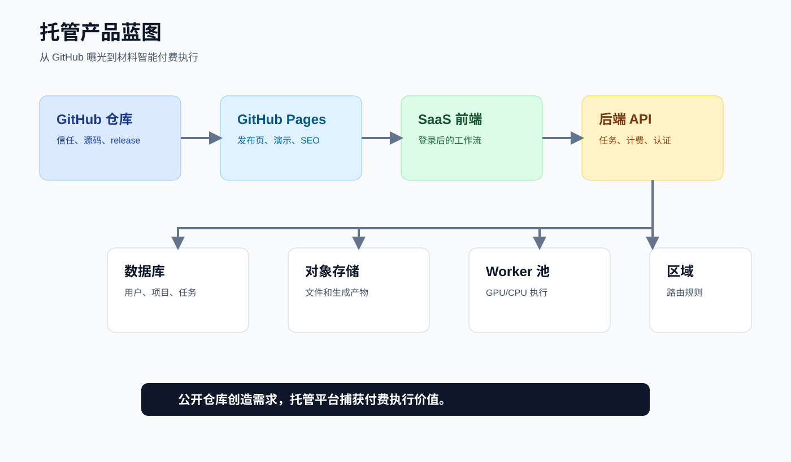

# Hosted Product Blueprint

公开阶段：`0.09`

这个蓝图说明当前公开的 Codex/MCP 发布面，如何连接到未来托管版材料智能设计平台。

它刻意不包含私有基础设施细节。不要把真实域名、数据库 URL、API key、账号 ID、路由规则、生产队列或本机路径写进这个文档。

## 产品分层

| 层 | 作用 | 公开仓库内容 | 私有/产品内容 |
| --- | --- | --- | --- |
| GitHub 仓库 | 信任、源码、可复现 | 开源代码、文档、release、issue | 不放密钥 |
| GitHub Pages | 静态曝光和 SEO | Landing page、Remotion 演示、benchmark 图 | 不跑后端 |
| SaaS 前端 | 用户工作流 | 公开截图或脱敏 UI 方案 | 登录后的应用 |
| 后端 API | 产品逻辑 | 只放 API 形态说明 | 账号、权限、计费、任务 |
| 数据库 | 持久状态 | 只放 schema 草图 | 用户、项目、任务、审计日志 |
| 对象存储 | 大文件产物 | 只放存储模式说明 | PDF、数据集、视频、生成文件 |
| Worker 池 | 重型执行 | worker 架构说明 | GPU/CPU 工作负载、ML、仿真 |
| 可观测性 | 可靠性 | 公开 SLO 原则 | 日志、trace、告警 |
| 合规 | 企业信任 | evidence 模板 | 签署控制项、客户数据策略 |

## 参考架构

## 推荐流程

1. 访问者进入 GitHub Pages。
2. 访问者观看 Remotion 演示。
3. 访问者打开 GitHub 仓库并运行诊断。
4. 高意向用户进入 waitlist、托管应用或咨询入口。
5. 托管 SaaS 完成用户认证。
6. 后端 API 创建项目并存储元数据。
7. 对象存储保存上传和生成产物。
8. Worker 池运行材料智能分析。
9. 结果带着审计证据返回 UI。
10. 通过订阅、用量计费、咨询或企业合同捕获商业价值。

## 部署选项

| 组件 | 小规模启动 | 增长阶段 | 企业阶段 |
| --- | --- | --- | --- |
| 静态站点 | GitHub Pages | Cloudflare Pages / Vercel | 自定义域名 CDN |
| 前端应用 | Vercel / Cloudflare Pages | Vercel Pro / Cloudflare | 企业 CDN |
| 后端 API | Render / Fly.io / Railway | AWS ECS / Azure Container Apps / GCP Cloud Run | Kubernetes 或托管应用平台 |
| 数据库 | Managed Postgres | Supabase / Neon / RDS / Azure Database | 高可用 Postgres + 备份 |
| 对象存储 | S3 兼容 bucket | S3 / R2 / Azure Blob / GCS | 区域感知存储 |
| Worker | 小型 CPU/GPU 实例 | 队列驱动 worker 池 | 自动伸缩 GPU/CPU 集群 |
| 队列 | Managed Redis / SQS 类队列 | SQS / PubSub / Service Bus | 带 DLQ 的企业队列 |
| 可观测性 | 基础日志 | OpenTelemetry + 托管日志 | 中央 SIEM 和 SLO dashboard |

## 定位和区域服务

定位/区域化服务应该属于后端能力，不属于静态页面能力。

用途包括：

- 选择最近区域；
- 执行数据驻留要求；
- 把上传文件路由到区域内存储；
- 满足企业或国家数据政策；
- 降低大文件访问延迟。

不要在公开仓库暴露私有区域路由规则。

## 商业闭环

1. 开源可信度带来发现。
2. GitHub Pages 讲清问题。
3. Remotion 视频增强传播。
4. 诊断和 benchmark 形成技术证据。
5. Privacy guard 降低信任摩擦。
6. 材料智能应用把高意向用户转成付费工作流。
7. 托管执行通过订阅、用量计费、咨询或企业合同捕获价值。

## 安全边界

可以公开：

- 架构模式；
- 脱敏示例；
- 合成 benchmark 数据；
- 发布安全视觉资产；
- 文档和模板。

必须私有：

- 账号状态；
- 密钥；
- 生产队列名；
- 私有路由；
- 客户数据；
- 模型供应商 key；
- 计费配置；
- 内部 dashboard。
